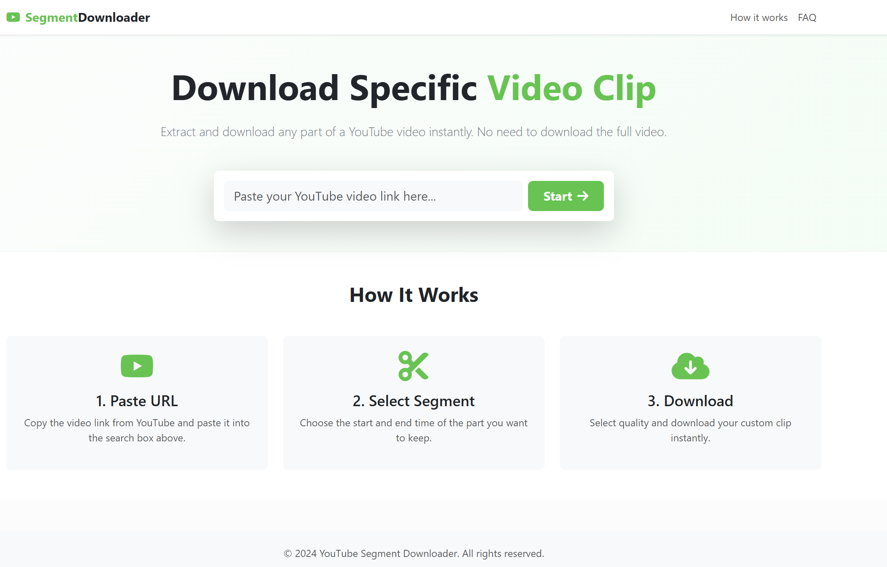

# YouTube Segment Downloader
```markdown

```

A Django-based backend service that allows users to download specific segments of YouTube videos.Features include video info extraction, time-range based segment downloading, background processing with Celery, and comprehensive API endpoints.

## Features

- **Extract Video Info**: Get metadata (title, duration, qualities) from YouTube URLs.
- **Segment Download**: Download only the specified time range of a video.
- **Background Processing**: Uses Celery and Redis to handle downloads asynchronously.
- **REST API**: Clean API for integration with frontend applications.
- **Smart Caching**: Temporarily stores full videos to speed up multiple segment requests.

## Tech Stack

- Django + Django REST Framework
- Celery + Redis
- yt-dlp (YouTube extraction)
- moviepy/ffmpeg (Video processing)
- SQLite (Dev) / PostgreSQL (Prod)
- Docker support

## Prerequisites

- Python 3.9+
- Redis (for Celery)
- ffmpeg (installed on system path)

## Setup Instructions

### 1. Clone the repository

```bash
git clone <repository-url>
cd ysd
```

### 2. Create Virtual Environment

```bash
python -m venv venv
# Windows
venv\Scripts\activate
# Linux/Mac
source venv/bin/activate
```

### 3. Install Dependencies

```bash
pip install -r requirements.txt
```

### 4. Configure Environment

Create a `.env` file in the root directory (or rename `.env.example` if provided):

```env
DEBUG=True
SECRET_KEY=your-secret-key
ALLOWED_HOSTS=localhost,127.0.0.1
CELERY_BROKER_URL=redis://localhost:6379/0
```

### 5. Run Migrations

```bash
python manage.py makemigrations
python manage.py migrate
```

### 6. Run Development Server

Ensure Redis is running, then start the Django server and Celery worker:

**Terminal 1 (Django):**
```bash
python manage.py runserver
```

**Terminal 2 (Celery Worker):**
```bash
celery -A core worker -l info --pool=solo
```
*Note: Use `--pool=solo` on Windows to avoid issues.*

## Docker Setup

You can run the entire stack using Docker Compose:

```bash
docker-compose up --build
```
This will start the web server on `http://localhost:8000`, the worker, and Redis.

## API Endpoints

### 1. Extract Video Info
**POST** `/api/extract-info/`
```json
{
    "youtube_url": "https://www.youtube.com/watch?v=..."
}
```

### 2. Download Segment
**POST** `/api/download-segment/`
```json
{
    "youtube_url": "https://www.youtube.com/watch?v=...",
    "start_time": 60,
    "end_time": 120,
    "quality": "720p"
}
```
Returns a `task_id`.

### 3. Check Task Status
**GET** `/api/task-status/<task_id>/`

Returns:
```json
{
    "task_id": "...",
    "status": "completed",
    "progress": 100,
    "download_url": "/media/downloads/file.mp4"
}
```

## Testing

Run tests with:
```bash
python manage.py test
```
